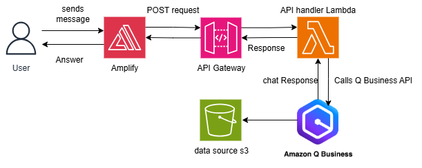

# Catholic Charities AI Assistant

A comprehensive chatbot application designed to provide users with real-time information and assistance related to Catholic Charities USA’s services, powered by Amazon Q Business and featuring a user-friendly interface for seamless interaction.

This application combines natural language processing with a knowledge base of Catholic Charities USA’s services and programs, delivering accurate, context-aware responses to user queries. It includes a responsive chat interface, FAQ prompts, and source attribution for transparency. The project is built with a serverless architecture using AWS services, ensuring scalability and ease of deployment.

Key features include:
- AI-powered responses using Amazon Q Business
- Responsive React-based frontend with Material-UI
- Predefined FAQ prompts for common queries
- Source attribution with clickable links
- Serverless backend with AWS Lambda, API Gateway, and S3
- Automated deployment via AWS CodeBuild and CloudShell
- Support for indexing web content from multiple URLs

## Repository Structure
```
.
├── Backend/                        # AWS CDK infrastructure and backend logic
│   ├── bin/                        # CDK app entry point
│   │   └── catholic-charities-cdk.ts
│   ├── data-sources/                  # Data source files for web crawling
│       └── urls1.txt                  # URLs for indexing
│   ├── lambda/                    # Lambda function code
│   │   └── lambda_function.py     # Chat handler for Amazon Q Business
│   ├── lib/                       # CDK stack definitions
│   │   └── catholic-charities-stack.ts
│   ├── deploy.sh                  # Deployment automation script
│   ├── buildspec.yml              # AWS CodeBuild configuration
│   ├── cdk.json                  
│   ├── package.json
│   ├── package-lock.json 
│   ├── .gitignore  
│   ├── tsconfig.json              
│   └── README.md
├── Frontend/                       # React-based web application
│   ├── public/                    # Static assets (e.g., favicon, manifest)
│   │   ├── favicon.ico
│   │   ├── manifest.json
│   │   └── Assets/                # Images (e.g., catholic_bot1.svg, UserAvatar.svg)
│   ├── src/                       # React source code
│   │   ├── Components/            # React components
│   │   │   ├── AppHeader.jsx      # Header with logo
│   │   │   ├── BotReply.jsx       # Bot message rendering
│   │   │   ├── ChatBody.jsx       # Main chat interface
│   │   │   ├── ChatHeader.jsx     # Chat title
│   │   │   ├── ChatInput.jsx      # User input field
│   │   │   ├── FAQExamples.jsx    # FAQ prompts
│   │   │   ├── LeftNav.jsx        # Sidebar navigation
│   │   │   └── UserReply.jsx      # User message rendering
│   │   ├── utilities/             # Shared utilities
│   │   │   ├── constants.js       # Configuration and text constants
│   │   │   ├── createMessageBlock.js # Message block creation utility
│   │   │   └── theme.js           # MUI theme configuration
│   │   ├── index.js               # React app entry point
│   │   ├── index.css              # Global styles
│   │   └── App.js                 # Main app component
│   ├── package.json               # Frontend dependencies and scripts
│   └── README.md                  # Frontend-specific README
└── README.md                      # ReadMe for the project.
```

## Deployment Instructions

### Common Prerequisites

- **Fork the Repository**:
  1. Navigate to `https://github.com/ridhamsonani-148/chatbot-template`.
  2. Click the "Fork" button in the top right corner.
  3. Select your GitHub account as the destination.
  4. Wait for the forking process to complete.
  5. Your copy will be at `https://github.com/YOUR-USERNAME/chatbot-template`.

- **GitHub Personal Access Token**:
  1. Go to GitHub Settings > Developer Settings > Personal Access Tokens > Tokens (classic).
  2. Click "Generate new token (classic)".
  3. Name the token and select the `repo` and `admin:repo_hook` scopes.
  4. Save the token securely.
  5. See [GitHub Documentation](https://docs.github.com/en/authentication/keeping-your-account-and-data-secure/managing-your-personal-access-tokens) for details.

- **AWS Account Permissions**:
  - Ensure permissions for Amazon Q Business, AWS Lambda, API Gateway, AWS Amplify, Amazon S3, AWS CodeBuild, and IAM role/policy management.
  - See [AWS IAM Policies](https://docs.aws.amazon.com/IAM/latest/UserGuide/access_policies.html).

- **Amazon Q Business Lite Setup**:
  1. Log in to the [AWS Management Console](https://console.aws.amazon.com/).
  2. Navigate to Amazon Q Business and select the **Lite** tier.
  3. Create an application with **anonymous access** enabled.
  4. Note: Amazon Q Business Lite supports web crawling and chat APIs used in this project.

### Deployment Using AWS CodeBuild and AWS CloudShell

#### Prerequisites
- Access to AWS CodeBuild and CloudShell.
- AWS CLI configured with credentials (`aws configure`).

#### Deployment
1. **Open AWS CloudShell**:
   - Click the CloudShell icon in the AWS Console navigation bar.
   - Wait for the environment to initialize.

2. **Clone the Repository** (use your forked copy):
   ```bash
   git clone https://github.com/YOUR-USERNAME/chatbot-template
   cd chatbot-template
   ```

3. **Navigate to Backend**:
   ```bash
   cd Backend
   ```

4. **Make the Deployment Script Executable**:
   ```bash
   chmod +x deploy.sh
   ```

5. **Run the Deployment Script**:
   ```bash
   ./deploy.sh
   ```
   - When prompted, provide:
     - **GitHub URL**: `https://github.com/YOUR-USERNAME/chatbot-template.git`.
     - **Other Parameters**: Press Enter for defaults or provide custom values (e.g., project name: `catholic-charities-hybrid`).
   - The script creates a CodeBuild project and deploys the stack (~15-20 minutes).

6. **Monitor Deployment**:
   - Go to AWS CodeBuild Console, select the project (e.g., `catholic-charities-hybrid-deploy`), and view build logs.

7. **Verify Deployment**:
   - Go to AWS Amplify Console.
   - Select the app (e.g., `catholic-charities-frontend`).
   - Access the URL (e.g., `https://main.<app-id>.amplifyapp.com`).
   - Test the chatbot with a query (e.g., "What does Catholic Charities do?").

### Manual CDK Deployment

#### Prerequisites
1. **AWS CLI**:
   - Install: [AWS CLI Guide](https://docs.aws.amazon.com/cli/latest/userguide/install-cliv2.html).
   - Verify: `aws --version`.

2. **Node.js and npm**:
   - Install: [Node.js](https://nodejs.org/).
   - Verify: `npm --version`.

3. **AWS CDK**:
   - Install: `npm install -g aws-cdk`.
   - Verify: `cdk --version`.

#### Deployment
1. **Clone the Repository**:
   ```bash
   git clone https://github.com/YOUR-USERNAME/chatbot-template
   cd chatbot-template
   ```

2. **Set Up Environment**:
   ```bash
   aws configure
   ```

3. **Install Backend Dependencies**:
   ```bash
   cd Backend
   npm install
   ```

4. **Bootstrap CDK**:
   ```bash
   cdk bootstrap --context projectName=catholic-charities-hybrid --context urlFilesPath=data-sources
   ```

5. **Deploy the Stack**:
   ```bash
   cdk deploy --context projectName=catholic-charities-hybrid --context urlFilesPath=data-sources
   ```

6. **Deploy Frontend**:
   ```bash
   cd ../Frontend
   npm install
   npm run build
   aws s3 cp ./build s3://<frontend-bucket-name>/builds/ --recursive
   ```

## Usage

1. **Sync Data Sources**:
   - Go to AWS Console > Amazon Q Business > Applications.
   - Select the application and trigger a sync job for the data source (e.g., `urls1.txt`).

2. **Access the Application**:
   - Navigate to the Amplify URL (e.g., `https://main.<app-id>.amplifyapp.com`).
   - Interact via the chat interface or FAQ prompts.

3. **Test Queries**:
   - Ask questions like "How can I donate?" or select FAQs.
   - Verify responses and source links.

### Troubleshooting

1. **API Gateway Errors**:
   - **Error**: "HTTP error! status: 500".
     - Check CloudWatch logs for the Lambda function.
     - Ensure `QBUSINESS_APPLICATION_ID` is set in the Lambda environment.

2. **Data Source Sync Issues**:
   - **Error**: "Data source sync job failed".
     - Verify URLs in `urls1.txt` are accessible.
     - Check Amazon Q Business Console for sync job status.

3. **Frontend Issues**:
   - **Error**: "API endpoints not configured".
     - Ensure `REACT_APP_API_BASE_URL`, `REACT_APP_CHAT_ENDPOINT`, and `REACT_APP_HEALTH_ENDPOINT` are set in Amplify environment variables.

## Data Flow

```ascii
User Query → Amplify Frontend → API Gateway → Lambda → Amazon Q Business → S3 Data Source
     ↑                                                           ↓
     └────────────────────── Response with Sources ───────────────┘
```

**Component Interactions**:
1. User submits a query via the frontend.
2. Amplify sends a POST request to API Gateway (`/chat`).
3. API Gateway invokes the Lambda function (`lambda_function.py`).
4. Lambda calls Amazon Q Business, which queries the indexed data.
5. Amazon Q Business returns a response with sources, sent back to the frontend.
6. Sources are displayed as clickable chips.

## Infrastructure



### Architecture Diagram Explanation

- **User → Amplify Frontend**:
  - Users access the chatbot via the Amplify-hosted React app.
  - The frontend sends queries to the API Gateway.

- **Amplify → API Gateway**:
  - API Gateway handles `/chat` (POST) and `/health` (GET) endpoints.
  - Routes requests to the Lambda function.

- **API Gateway → Lambda**:
  - The Lambda function (`lambda_function.py`) processes queries and invokes Amazon Q Business.

- **Lambda → Amazon Q Business**:
  - Amazon Q Business processes queries using a web crawler data source.
  - Retrieves content from URLs stored in S3 (e.g., `urls1.txt`).

- **Amazon Q Business ↔ S3**:
  - S3 stores data source files for indexing.
  - A custom Lambda (`DataSourceCreator`) creates and syncs data sources.

- **EventBridge → Amplify Deployer**:
  - S3 uploads (e.g., frontend builds) trigger the `AmplifyDeployer` Lambda to start Amplify deployments.

**AWS Services**:
- **Amazon Q Business**: Conversational AI and indexing.
- **AWS Lambda**: Handles chat logic and data source creation.
- **API Gateway**: Manages API endpoints.
- **S3**: Stores data sources and frontend artifacts.
- **AWS Amplify**: Hosts the frontend.
- **EventBridge**: Triggers deployments.
- **CodeBuild**: Automates deployment.

**Environment Variables**:
- `QBUSINESS_APPLICATION_ID`: Set in Lambda for Q Business access.
- `REACT_APP_API_BASE_URL`, `REACT_APP_CHAT_ENDPOINT`, `REACT_APP_HEALTH_ENDPOINT`: Set in Amplify for frontend API calls.

## Adding More URLs to Data Source

1. **Update URLs**:
   - Add new URLs to `data-sources/urls1.txt` or create new `.txt` files.
   - Example: Add `https://catholiccharitiesusa.org/about`.

2. **Sync Data Source**:
   - Re-run `./deploy.sh` or manually trigger a sync job in Amazon Q Business Console.
   - Monitor sync status in the console.

3. **Limits**:
   - Up to 50 data sources per Q Business application.
   - Each data source can handle multiple URLs (up to 100, per AWS limits).

## Maintenance

- **Monitor Logs**: Use CloudWatch for Lambda and API Gateway logs.
- **Update Dependencies**: Regularly update Node.js, Python, and CDK packages.
- **Security**: Ensure HTTPS is used and update IAM roles as needed.

## Contributing

1. Fork the repository.
2. Create a feature branch: `git checkout -b feature/your-feature`.
3. Commit changes: `git commit -m "Add your feature"`.
4. Push and create a pull request: `git push origin feature/your-feature`.

## License

This project is licensed under the MIT License.

## Contact

For support, contact [support@catholiccharitiesusa.org](mailto:support@catholiccharitiesusa.org).